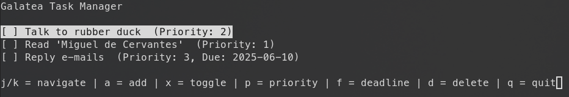

# 📔 Galatea - Open Source Task Manager
## What is Galatea?
Galatea is a lightweight and efficient command-line task manager application
designed for users who prefer managing tasks directly from the terminal. It
provides essential task management features with minimal overhead, making it
ideal for developers.

## Features
- Add, edit, mark as done and delete tasks via simple commands.
- Assign priorities and deadlines to tasks.
- Two modes of operation:
  - CLI Mode: Use commands like `galatea add "Task description"` for quick task management and automation.
  - TUI Mode: Run `galatea` without any argument to access an interactive terminal interface with keyboard controls.
- Store task data in `~/.config/galatea/galatea-tasks.txt`, keeping your workspace clean.
- Implemented in C with minimal dependencies, requiring only `ncurses` for the text-based user interface.

## Usage
### TUI
To open the Galatea Text User Interface, simply run:

```
galatea
```


### CLI
These are the multiple verbs available for Galatea Command Line Interface.
```
# List all tasks
galatea list 

# Add a new task
galatea add "task" 

# Mark / unmark task
galatea mark <number>

# Delete task
galatea delete <number>

# Edit task
galatea edit <number> "new text"

# Add or modify task's deadline
galatea deadline <number> YYYY-MM-DD

# Add or modify task's priority 
galatea priority <number> <1|2|3>
```

## Where are tasks stored?
Tasks are stored in plain text in `~/.config/galatea/`.

## Compile and install
### Dependencies
- ncurses

### Compilation and isntallation
To build Galatea, run:
```
make
```

To install Galatea in `~/.local/bin`, run:
```
make install
```

To uninstall Galatea from `~/.local/bin`, run:
```
make uninstall
```

Ensure that `~/.local/bin` is present in your `PATH` environment variable.

